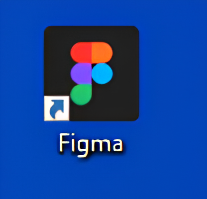
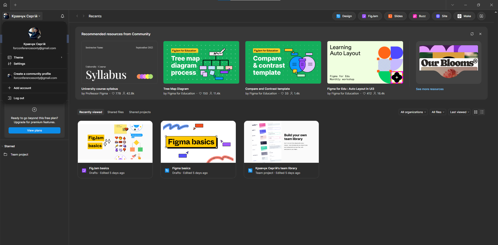
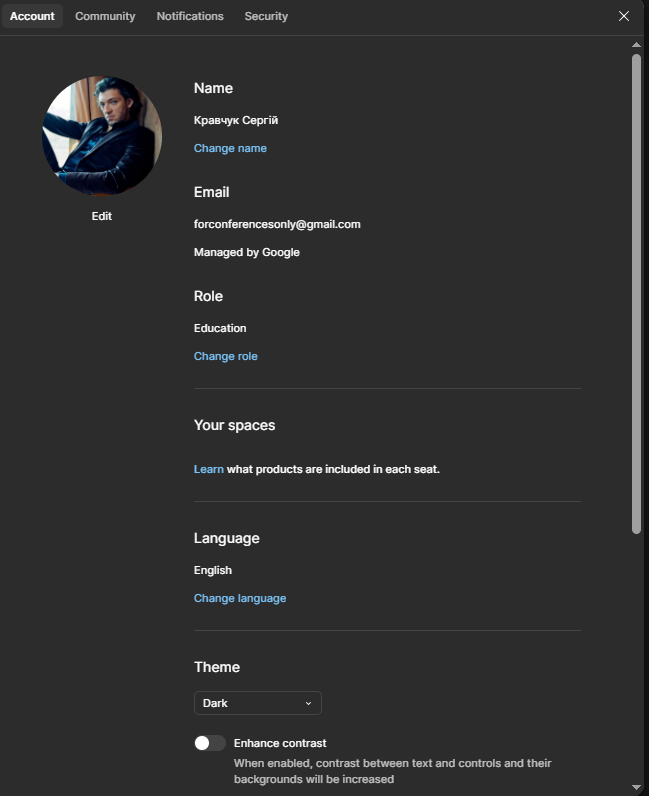

# Практична робота №1 – ОГЛЯД І ПОРІВНЯЛЬНА ХАРАКТЕРИСТИКА СЕРВІСІВ ДЛЯ ПРОЕКТУВАННЯ КОРИСТУВАЛЬНИЦЬКИХ ІНТЕРФЕЙСІВ

## Хід роботи:
Мета цієї практичної роботи - завантажити декстопну версію Figma та зареєструватися у цьому онлайн-сервісі. Все було виконано, використовувався офіційний сайт (https://www.figma.com), а щоб заощадити час, етап реєстрації був пройдений завдяки раніше створеному обліковому запису Google.

### Ярлик програми на робочому столі:

### Зовнішній вигляд десктопної версії:

### Фото зареєстрованого облікового запису:

## Висновки:
>*Що було зроблено на практиці?*
>Були виконані перші кроки для початку роботи в онлайн-сервісі розробки інтерфейсів та прототипування Figma, а саме: завантаження десктопної версії програми та реєстрація.   

>*Чому я навчився?*  
>Цей етап був вступом у новій для мене дисципліні, певним ознайомленням з інтерфейсом програми та можливою подальшою роботою безпосередньо у цій програмі. 
