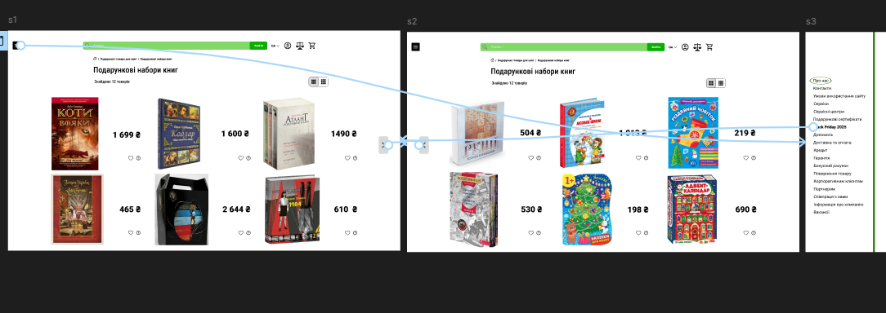
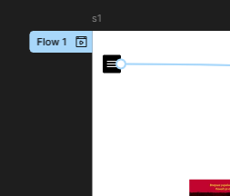
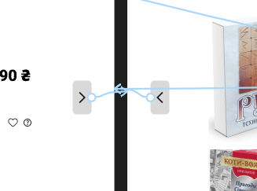
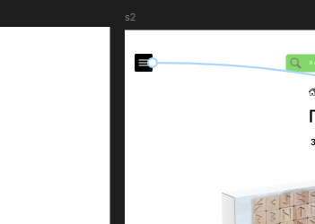
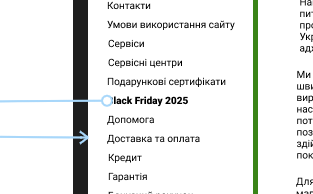

# Практична робота №12 Розробка wireframe

## Хід роботи:
Мета цієї практичної роботи - створити у Figma  деталізований  вайрфрейм  сайту для інтернет-магазину (головна сторінка та 2-3 сторінки товару). Тематику обрати самостійно. Розмір екранів - desktop.
Використати інструменти прототипування і зробити клікабельний прототип на основі вайфрейму.

https://skvot.io/uk/blog/ne-soromno-zapitati-shcho-take-vayrfreym-mokap-i-prototip?authuser=0
https://www.youtube.com/watch?v=Sdmk050xcDA&authuser=0
https://www.youtube.com/watch?v=fe_QfW-6i4w&authuser=0
https://www.youtube.com/watch?v=Lis9V4rYPzY&authuser=0

### Результат роботи:

Перелік клікабельних об'єктів:

Перехід з 1-го слайду (1-а сторінка товару) на 3-й (головна сторінка)

Перехід з 1-го слайду (1-а сторінка товару) на 2-й (2-а сторінка товару) та навпаки

Перехід з 2-го слайду (2-а сторінка товару) на 3-й (головна сторінка), як і перший клікабельний об'єкт

Перехід з 3-го слайду (головна сторінка) на 1-й (1-а сторінка товару)

Посилання на виконане завдання - https://www.figma.com/design/2lLDx5u9mIJmd1lQqx4DvM/Untitled?node-id=15-2&p=f&t=kLoztQwWmBLNUqZt-0.

Посилання на прототип - https://www.figma.com/proto/2lLDx5u9mIJmd1lQqx4DvM/Untitled?node-id=67-114&starting-point-node-id=67%3A114.

## Висновки:
>*Що було зроблено на практиці?*  
>
>На практиці було створено клікабельний прототип на основі вайфрейму.   

>*Чому я навчився?*  
>

>Я навчився працювати із вкладкою Prototype і тепер маю усі необхідні знання щоб створювати клікабельні прототипи. 
