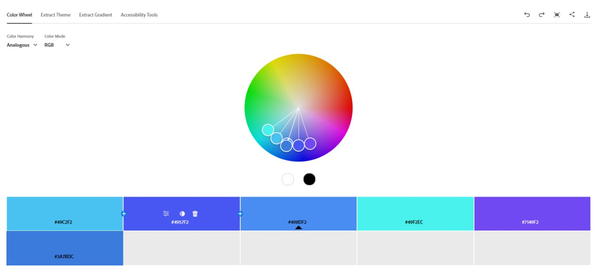
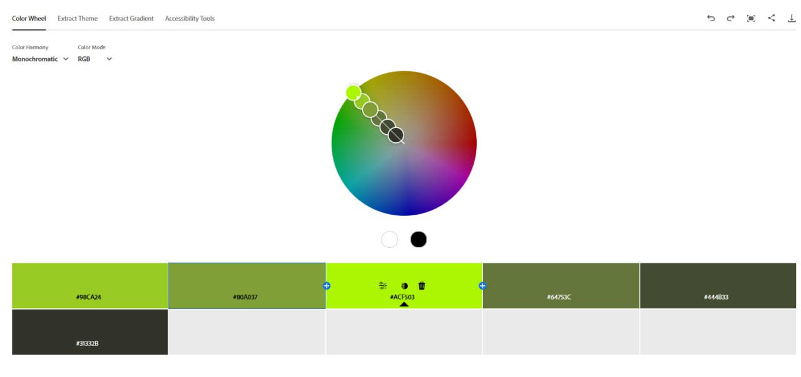
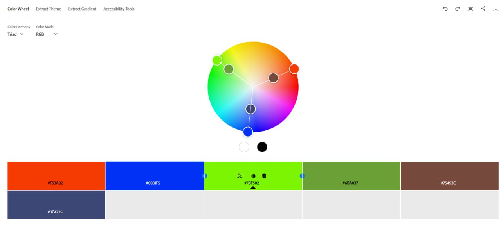
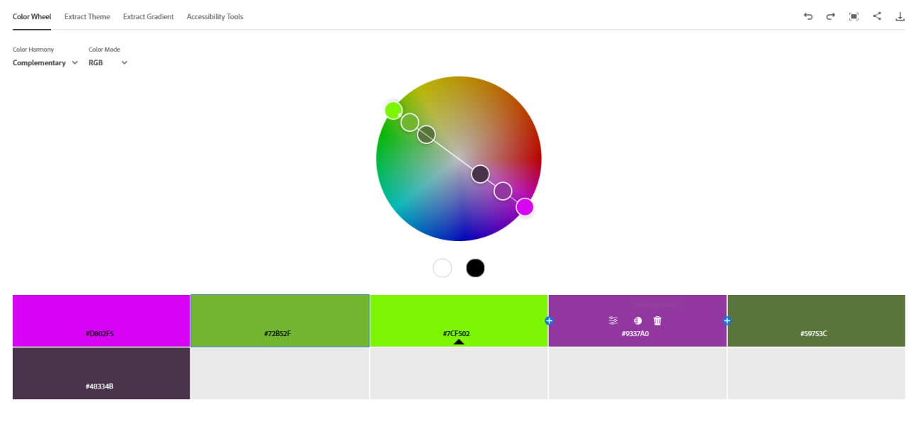
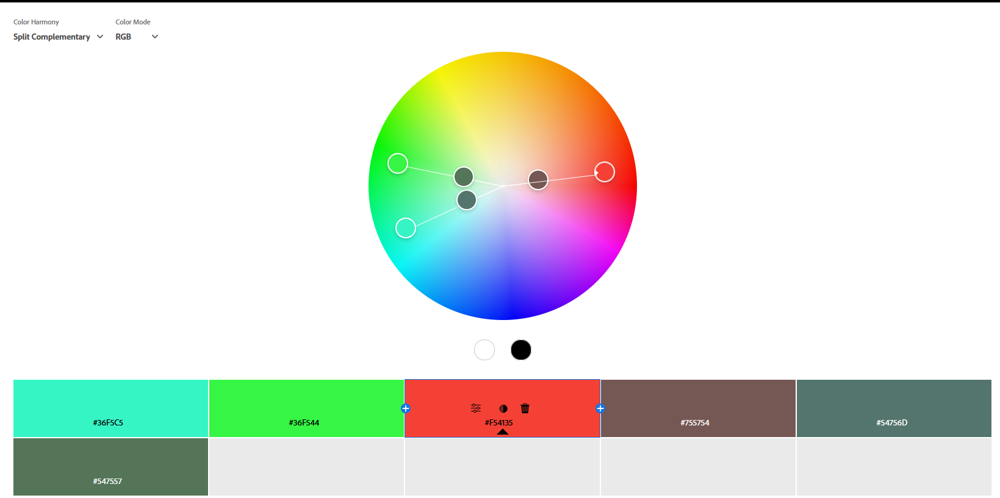
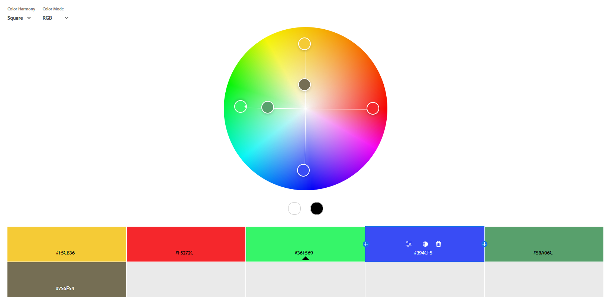
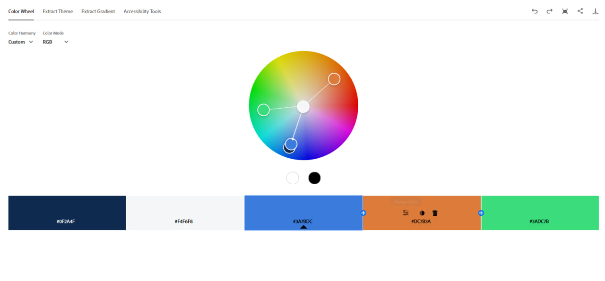
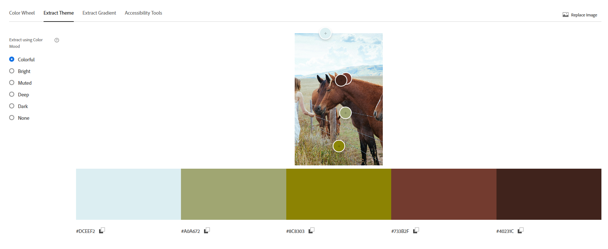
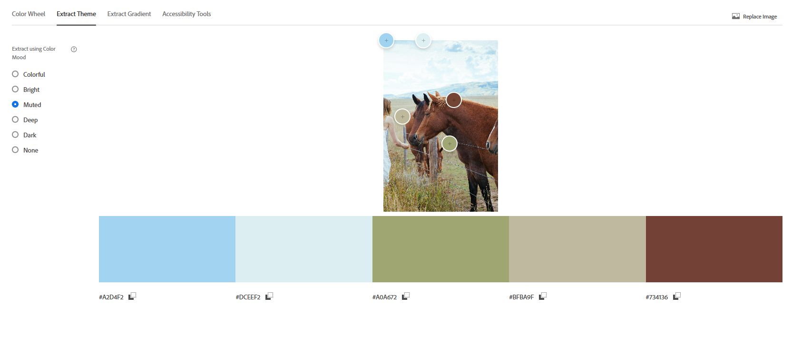
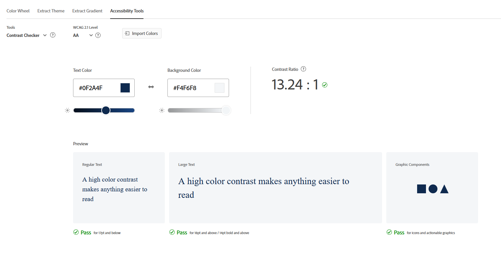

# Практична робота №13 “Дослідження кольорових гармоній та інструментів аналізу кольору в Adobe Color” 

## Хід роботи:
Мета цієї практичної роботи:
1. Ознайомити студентів із поняттям кольорової гармонії та основними типами 
гармонії кольорів. 
2. Навчити студентів використовувати колірне колесо для побудови палітр за різними 
принципами гармонії. 
3. Ознайомити із можливостями автоматичного виділення кольорових палітр із 
зображень та створення градієнтів. 
4. Навчити перевіряти контрастність кольорових пар відповідно до стандартів 
доступності (WCAG). 
5. Закріпити навички документування та аналізу роботи з кольором у 
Markdown-форматі у GitHub-репозиторії.

Повідомляю, що ознайомився із теоретичною частиною для самостійного ознайомлення перед виконанням практичної частини завдання.

### Практичне завдання 
Робота з колірним колесом (Color Wheel) 
1. Виберіть базовий колір. 
2. Створіть палітри для кожного типу гармонії: - 
Analogous - - - - - - 
Monochromatic 
Triad 
Complementary 
Split Complementary 
Square 
Custom 
3. Для кожної палітри: - 
Зафіксуйте скріншот. - - - 
Підпишіть тип гармонії. 
Вкажіть базовий колір. 
Коротко опишіть логіку побудови і передбачуваний емоційний ефект. 
    Створення палітри зображенням (Extract Theme) 
4. Завантажте будь-яке зображення у розділ Extract Theme. 
5. Створіть палітру у двох варіантах настрою: - 
Colorful - 
Muted 
6. Збережіть скріншоти обох варіантів і коротко опишіть: - 
Яка палітра більше підходить для інтерфейсу додатку? - 
Чому? 
    Створення градієнту на основі зображення (Extract Gradient) 
7. Завантажте те саме або інше зображення у розділ Extract Gradient. 
8. Створіть градієнт з трьома кольоровими точками (Gradient Stops = 3). 
9. Збережіть скріншот побудованого градієнта. 
    Аналіз контрасту (Accessibility Tools) 
10. Використовуючи будь-яку комбінацію кольорів із попередніх палітр: - 
Виберіть одну пару кольорів для тексту та фону. - 
Перевірте контрастність у Accessibility Tools. 
11. Зафіксуйте: - - 
Рівень контрасту. 
Чи проходить ця пара перевірку для звичайного тексту (AA) і великого тексту 
(AAA). Якщо контраст недостатній — використайте запропоновану корекцію і 
збережіть скріншот.

### Виконання роботи:
### 1. Робота з колірним колесом (Color Wheel):

Інструмент для виконання кожного з етапів цієї практичної роботи - https://color.adobe.com/en/

Тип: Analogous
База: #3A7BDC
Логіка побудови: кольори поруч на колесі (тобто базовий та декілька сусідніх відтінків по дузі), мінімальний контраст, висока цілісність.
Емоційний ефект: м’якість і єдність. Підходить для спокійних інтерфейсів, фонів, великих площин із тонкими акцентами.

Тип: Monochromatic

База:#ACF503

Логіка побудови: монохромна гармонія створюється шляхом варіювання одного кольору — його світлих, темних і приглушених відтінків. Це забезпечує візуальну єдність, простоту та легкість сприйняття.

Емоційний ефект: #ACF503 — яскравий, майже неоновий зелено-жовтий: енергія, свіжість, технологічність, темніші відтінки (#444B33, #31332B) — стабільність, глибина, заземлення, світліші (#98CA24, #80A037) — натхнення, екологічність, легкість

Тип: Triad
База: #7BF502
Логіка побудови: тріадна гармонія поєднує три кольори, що рівновіддалені на колірному колесі. Це забезпечує баланс між контрастом і гармонією — кольори різні, але не конфліктують.
Емоційний ефект: #7BF502 (база) - cвіжість, природа, оновлення, #F53A02 - eнергія, дія, тепло, імпульсивність, #0031F5 - глибина, інтелект, технологічність.

Тип: Complementary
База: #7BF502
Логіка побудови: комплементарна гармонія поєднує два протилежні кольори та їх відтінки на колірному колесі. Це створює максимальний контраст, який привертає увагу та підсилює візуальний фокус.
Емоційний ефект: #7BF502 (база) - cвіжість, природа, оновлення, темніші варіанти (#48334B, #59753C): стабільність, глибина, баланс. #D802F5 - експресія, креативність, емоційна насиченість.

Тип: Split Complementary
База: #F54135 
Логіка побудови: використовується базовий колір та два кольори, що розташовані по обидва боки від його прямого комплементарного. Це створює контраст, але більш м’який і гармонійний, ніж у чистій комплементарній схемі. Коди кольорів: #F54135 (база), #36F544, #36F5C5, #755754, #54756D, #547557 
Емоційний ефект: поєднання червоно-оранжевого з зеленим та бірюзовим дає відчуття енергії й дії, врівноважене свіжістю та технологічною легкістю. Темні відтінки додають стабільності та глибини, формуючи виразну, але не агресивну атмосферу.

Тип: Square 
База: #36F569
Логіка побудови: використовується чотири кольори, рівновіддалені на колірному колесі (через кожні 90°), що забезпечує баланс між теплими та холодними тонами. Така схема створює багатогранну палітру з високим контрастом, але без домінування одного кольору. Коди кольорів: #36F569 (база), #F5CB36, #F5272C, #394CF5, #58A06C, #756E54 
Емоційний ефект: поєднання червоного, жовтого, зеленого та синього створює яскраву, живу, динамічну атмосферу. Палітра передає енергію, оптимізм, технологічність і природність, а нейтральні відтінки додають глибини та стабільності. Добре підходить для творчих інтерфейсів, ігрових платформ або візуально насичених презентацій.

Тип: Custom 
База: #3A7BDC
Логіка побудови: кольори підібрані вручну під умовну задачу. Гармонія не базується на геометричних правилах колірного колеса, а на функціональній та емоційній сумісності кольорів. Коди кольорів: #3A7BDC (база), #F4F6F8, #0F2A4F, #DC7B3A, #3ADC7B 
Емоційний ефект: палітра поєднує глибокий темно-синій як опору для тексту та фону, світло-сірий для нейтральних зон, яскравий синій для акцентів, теплий оранжевий для дії та зелений для позитивних сигналів. Це структурність і емоційний баланс, ідеально підходить для сучасного інтерфейсу з чіткою ієрархією та комфортною взаємодією з клієнтом.

### 2. Створення палітри зображенням (Extract Theme):

Обрано випадкове зображення без авторських прав

Colorful
#DCEEF2 (світло-блакитний)
#A0A672 (оливковий)
#8C8303 (жовто-зелений)
#733B2F (червоно-коричневий)
#40231C (темно-коричневий)

Оцінка: Палітра передає природну енергію, контраст і емоційність. Вона добре працює для ілюстрацій, маркетингових блоків або візуального контенту, але може бути надто насиченою для тривалого використання в інтерфейсі — особливо через темні та яскраві кольори, які ускладнюють читабельність тексту.

Muted
#A2D4F2 (приглушений небесно-блакитний)
#DCEEF2 (блідо-блакитно-сірий)
#A0A672 (приглушений оливковий)
#BFBA9F (м’який бежевий)
#734136 (глибокий червоно-коричневий)

Оцінка: Палітра передає спокій, природність і комфорт. Вона ідеально підходить для інтерфейсу додатку, оскільки не перевантажує очі, легко поєднується з текстом, забезпечує хорошу контрастність і підтримує емоційно нейтральне середовище для користувача.

### Створення градієнту на основі зображення (Extract Gradient):

### Аналіз контрасту (Accessibility Tools):

Для цього етапу було використано два кольори - 0F2A4F (текст) та F4F6F8 (фон), обидва кольори було взято з Custom Color Wheel. 
Як бачимо, у результаті отримано контраст 13.24 : 1, що проходить перевірку для звичайного тексту (AA), великого тексту (AAA) та графічних компонентів (icons and actionable graphics).

## Висновки:
>*Що було зроблено на практиці?*  
>
>На практиці було створено палітри для основних типів кольорових гармоній за допомогою Adobe Color, з визначенням базового кольору, логіки побудови та емоційного ефекту. Проведено аналіз кольорів із зображень у двох варіантах настрою (Colorful та Muted), а також створено градієнт на основі фото.   

>*Чому я навчився?*  
>

>Я навчився розпізнавати кольорові гармонії, створювати палітри з емоційним впливом, витягувати кольори з зображень та створювати градієнти. 

