# Практична робота №14 Оптимізація зображень за допомогою Squoosh

## Хід роботи:
Мета цієї практичної роботи:

Ознайомити студентів із методами стиснення зображень та їхнім впливом на якість.

Навчити визначати оптимальний баланс між якістю та розміром файлу.

Ознайомити студентів із різними типами стиснення: без втрат (lossless) та з втратами (lossy).

Дослідити вплив зміни розміру на якість зображення та вагу файлу.

Навчитися адаптувати зображення для різних цільових застосувань:

Веб (оптимізація для швидкого завантаження).

Мобільні пристрої (зменшені розміри, ефективне стиснення).

Retina-дисплеї (2x, 3x версії для збереження якості).

Закріпити навички документування та аналізу результатів у Markdown-форматі у GitHub-репозиторії.

Повідомляю, що ознайомився із теоретичною частиною для самостійного ознайомлення перед виконанням практичної частини завдання.

### Практичне завдання 

1. Аналіз вихідних файлів

Виберіть 3 типи зображень (фотографія, скріншот, графічне зображення з текстом). 

Зафіксуйте їхній початковий розмір, формат (JPEG, PNG тощо) та вагу файлу.

2. Стиснення без втрати якості (lossless)

Завантажте кожне зображення в Squoosh. 

Використайте формати PNG (lossless) та WebP (lossless). 

Зафіксуйте зміни у вазі файлу після кожного перетворення. 

Переконайтеся, що якість зображення залишилася незмінною. 

3. Стиснення з втратою якості (lossy)

Використайте формати MozJPEG, WebP (lossy) та AVIF. 

Виконайте стиснення на рівнях якості 100%, 75% та 50%.

Зафіксуйте зміни розміру файлу.

Визначте мінімальний рівень якості, при якому зображення залишається прийнятним.

4. Оптимізація розміру відповідно до цільового використання

Зменшіть розмір зображень відповідно до їхнього застосування:

Для вебу: максимальна ширина 1200 px.

Для мобільних пристроїв: максимальна ширина 600 px.

Для Retina-дисплеїв: створіть 2x або 3x версію зображення.

Зафіксуйте зміни у вазі файлу після кожного етапу.

5. Візуальний аналіз та висновки

Порівняйте вихідні та оптимізовані зображення.

Визначте, які формати та параметри оптимізації найкраще підходять для кожного типу зображень.

### Виконання роботи:
### 1. Аналіз вихідних файлів

Випадкова фотографія без авторських прав, jpg, вага - 2 434 582 байт, ширина - 3569, висота - 2000 пікселей.

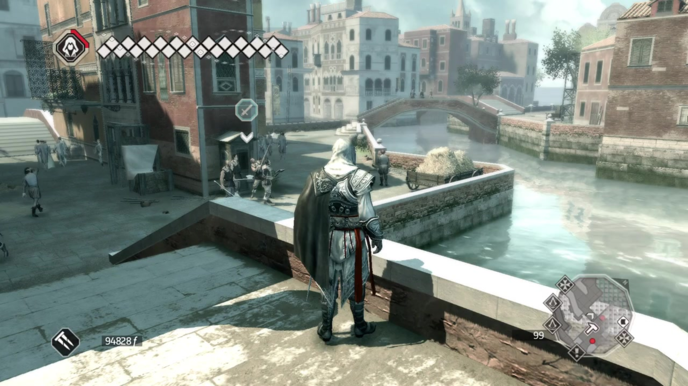

Скріншот з гри Assassins Creed 2 (2009), png, вага - 2 159 574 байт, ширина - 1920, висота - 1080 пікселей.

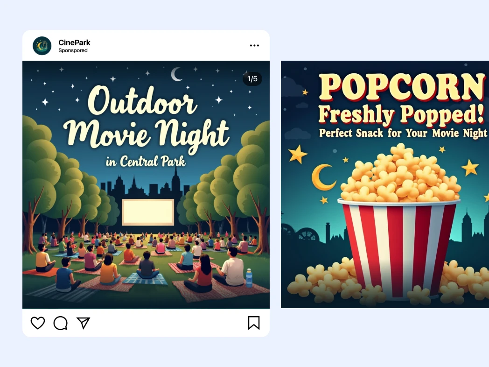

Випадкове зображення без авторських прав, png, вага - 691 420 байт, ширина - 1048, висота - 786 пікселей.

### 2. Стиснення без втрати якості (lossless)

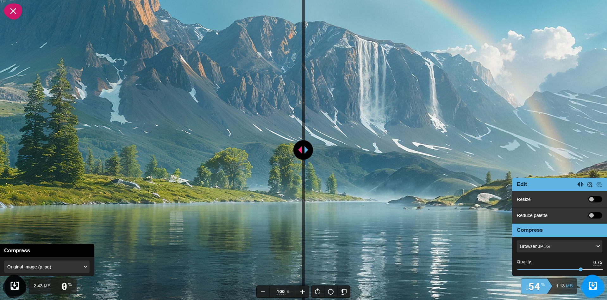

Вага: стара - 2.43 MB, нова - 1.13 MB. За моєю власною оцінкою якість не змінилась.

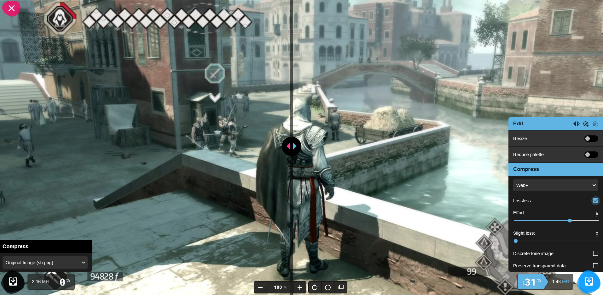

Вага: стара - 2.16 MB, нова - 1.48 MB. За моєю власною оцінкою якість не змінилась.

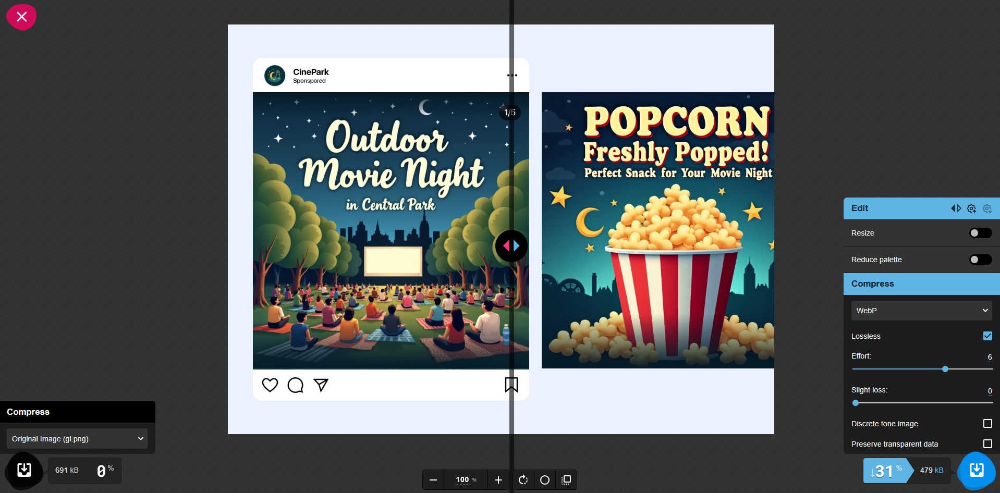

Вага: стара - 691 kB, нова - 479 kB. За моєю власною оцінкою якість не змінилась.

### 3. Стиснення з втратою якості (lossy)

Вага: стара - 2.43 MB, нова - 3.76 MB, стиснення - 100

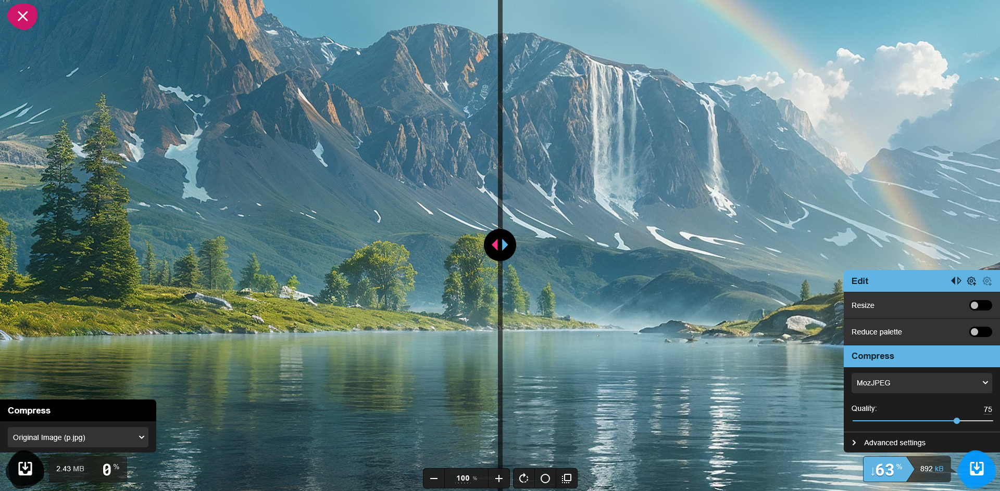

Вага: стара - 2.43 MB, нова - 892 kB, стиснення - 75

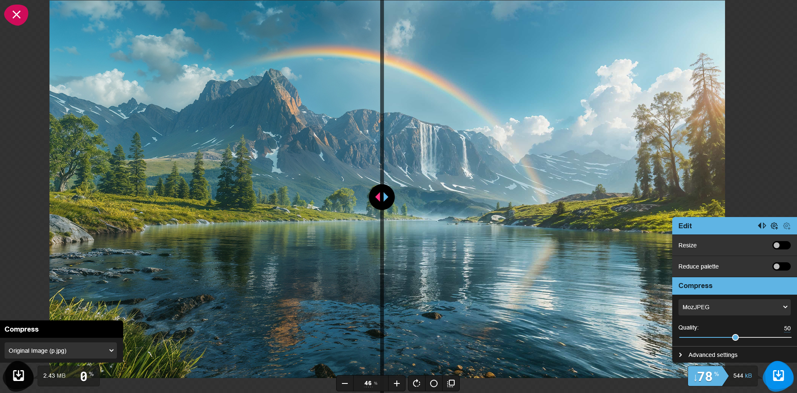

Вага: стара - 2.43 MB, нова - 544 kB, стиснення - 50

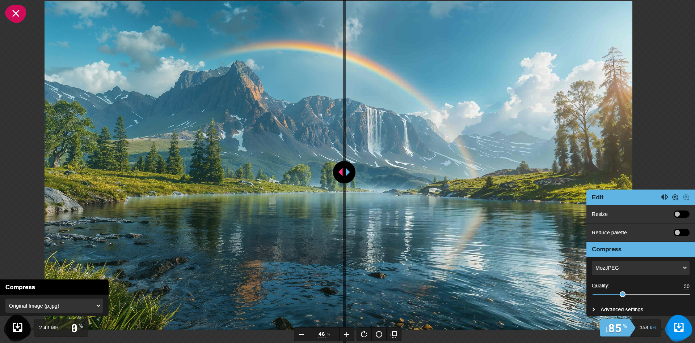

Вага: стара - 2.43 MB, нова - 358 kB, стиснення - 30, - мінімальний рівень якості

Вага: стара - 2.43 MB, нова - 56.1 kB, стиснення - 5, - приклад низької якості

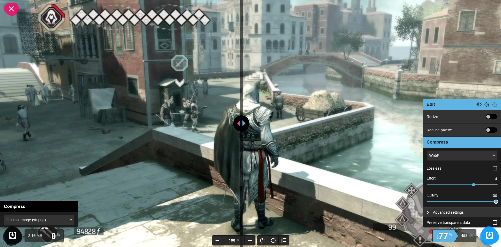

Вага: стара - 2.16 MB, нова - 498 kB, стиснення - 100

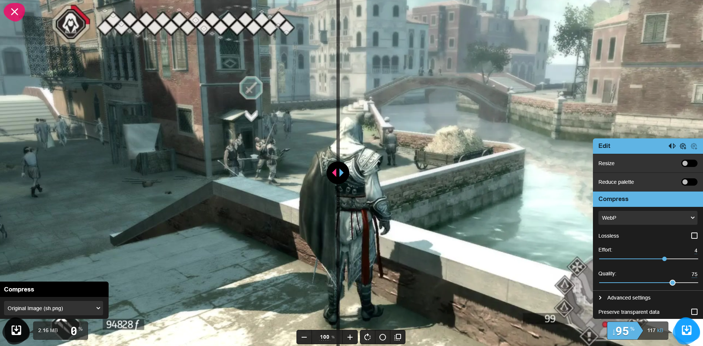

Вага: стара - 2.16 MB, нова - 117 kB, стиснення - 75

Вага: стара - 2.16 MB, нова - 86.8 kB, стиснення - 50

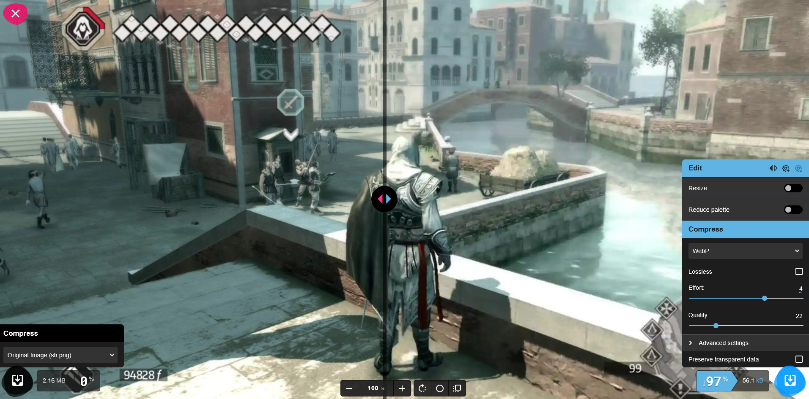

Вага: стара - 2.16 MB, нова - 56.1 kB, стиснення - 22, - мінімальний рівень якості

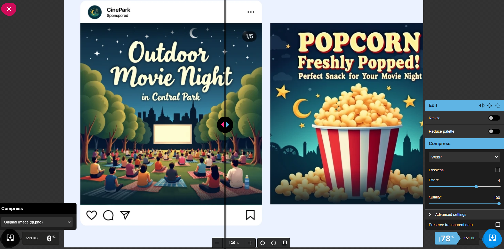

Вага: стара - 691 kB, нова - 151 kB, стиснення - 100

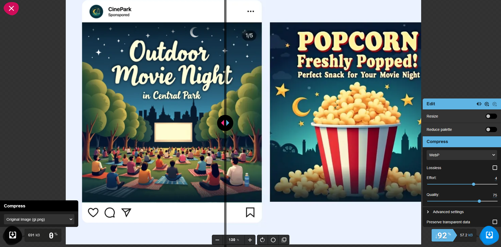

Вага: стара - 691 kB, нова - 57.2 kB, стиснення - 75

Вага: стара - 691 kB, нова - 46.9 kB, стиснення - 50

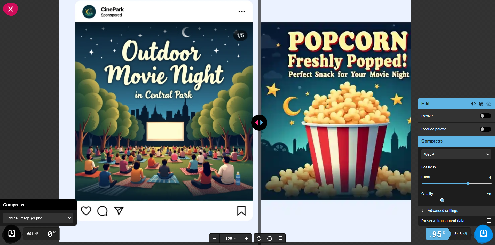

Вага: стара - 691 kB, нова - 34.6 kB, стиснення - 28, - мінімальний рівень якості

### 4. Оптимізація розміру відповідно до цільового використання

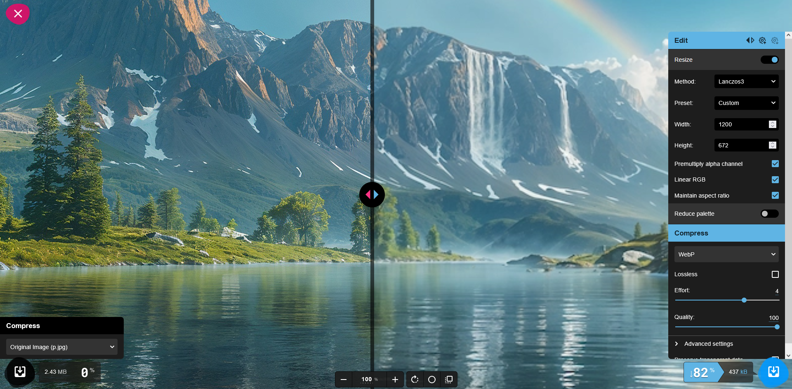

Для вебy
Вага: стара - 2.43 MB, нова - 437 kB

Для мобільних пристроїв
Вага: стара - 2.43 MB, нова - 117 kB

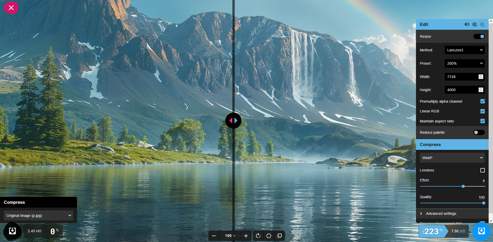

Для Retina-дисплеїв
Вага: стара - 2.43 MB, нова - 7.86 MB

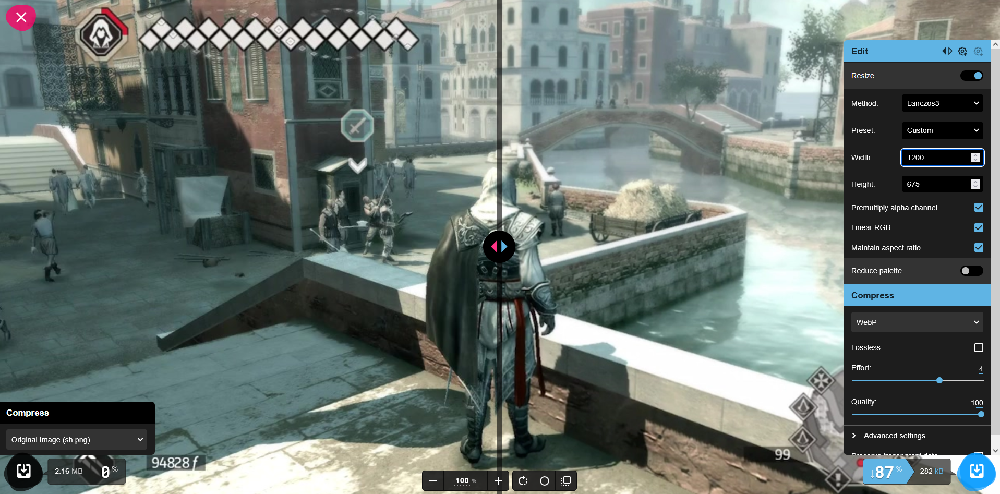

Для вебy
Вага: стара - 2.16 MB, нова - 282 kB

Для мобільних пристроїв
Вага: стара - 2.16 MB, нова - 101 kB

Для Retina-дисплеїв
Вага: стара - 2.16 MB, нова - 1.14 MB

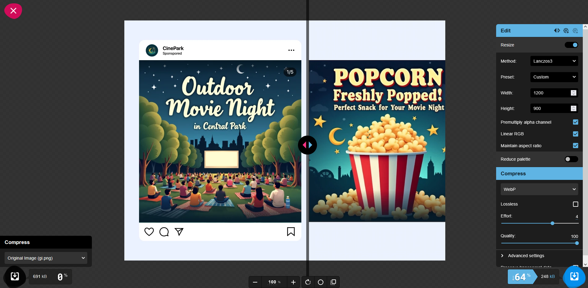

Для вебy
Вага: стара - 691 kB, нова - 248 kB

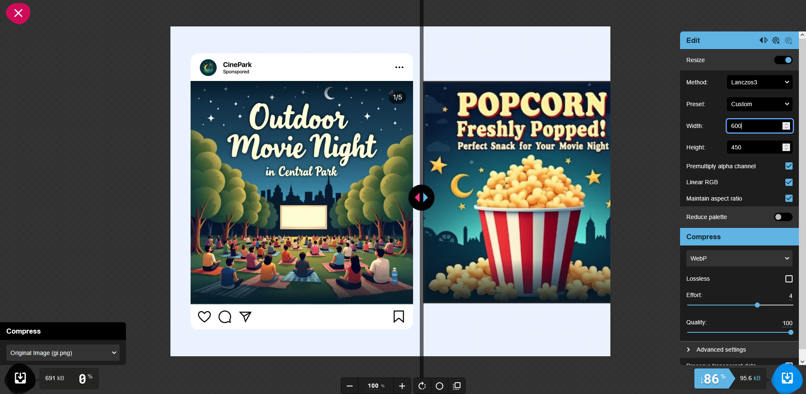

Для мобільних пристроїв
Вага: стара - 691 kB, нова - 95.6 kB

Для Retina-дисплеїв
Вага: стара - 691 kB, нова - 484 kB

### 5. Візуальний аналіз та висновки
Для jpg - MozJPEG (75%) - значне зменшення ваги при збереженні деталей, AVIF (75%) - найменший розмір файлу при високій якості, але може бути довший час обробки.

Для png - WebP (lossless) - значно менша вага при збереженні чіткості.

Для Графічні зображення з текстом (png) - WebP (lossless) - зберігає чіткість тексту, зменшує вагу.

## Висновки:
>*Що було зроблено на практиці?*  
>
>Проаналізовано 3 типи зображень (фото, скріншоти, графіка з текстом). Виконано lossless і lossy стиснення в MozJPEG, WebP, AVIF. Визначено мінімально прийнятну якість для кожного типу, оптимізовано розміри під веб, мобілки та Retina. Проведено візуальне порівняння й обрано найкращий формат для кожного із зазначених випадків.   

>*Чому я навчився?*  
>
>Розрізняти що таке lossless і lossy‑стиснення та їхній вплив на якість та адаптувати зображення під різні сценарії використання (веб, мобайл, Retina). 
