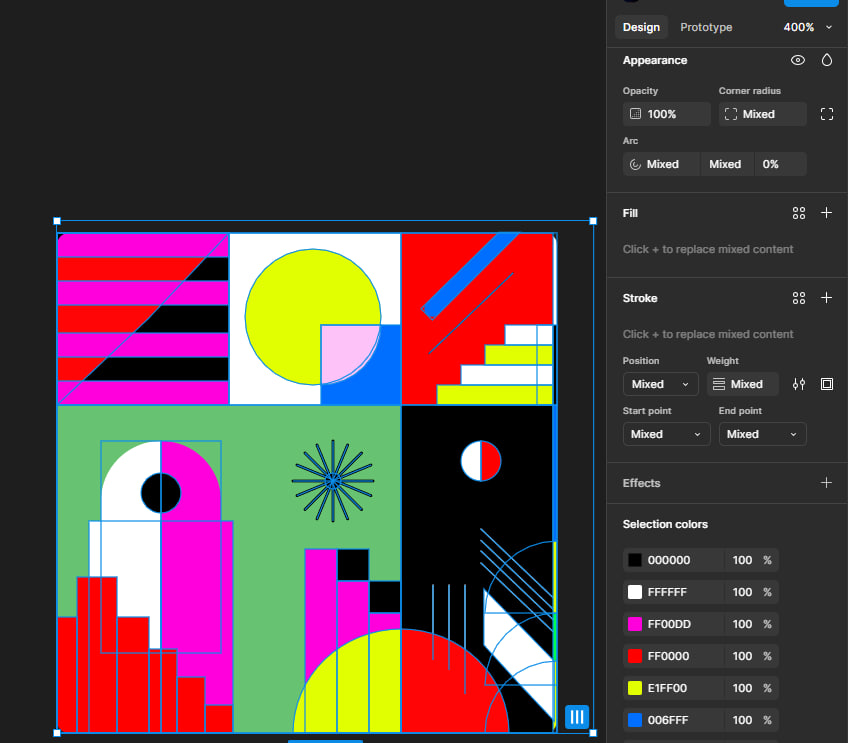
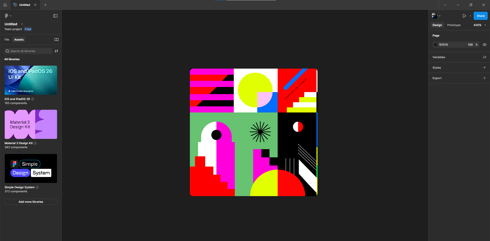

# Практична робота №3 – Робота з простими формами та їх властивостями у Figma. Створення геометричного візерунку. Частина 2

## Хід роботи:
Мета цієї практичної роботи - Опрацювати матеріал розділу 8 за Керівництвом користувача Figma та використовуючи прості фігури  та їх властивості сервісу Figma створити фрагмент геометричного візерунку (приклади візерунків прикріплено до цього завдання - https://www.figma.com/file/3fUhVxZnRrlhGqkdTR9RT8/20-Patterns-%28Community%29?type=design&node-id=101-60&mode=design&t=BCJ2ZrG3S10L98hk-0&authuser=0)

Повідомляю, що ознайомився з розділом 8 керівництва користувача Figma.

### Обраний геометричний фрагмент для відтворення:

### Результати роботи:

## Висновки:
>*Що було зроблено на практиці?*
>
>На практиці використовувалися прості геометричні фігури, з яких створювалися більш складні та своєрідні геометричні візерунки.   

>*Чому я навчився?*
>
>Цей етап був складнішим за попередній, довелося ретельно ознайомитися із текстовим матеріалом, і завдяки цьому мені вдалося відтворити певний фрагмент геометричного візерунку у Figma. 

