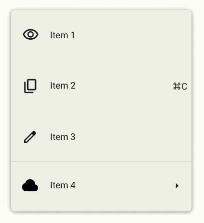

# Практична робота №4 – Фрейми, групи і секції у Figma

## Хід роботи:
Мета цієї практичної роботи - виконати завдання Basic (обов'язково) та Medium з Advanced (за бажанням). Посилання на завдання - https://drive.google.com/file/d/1XvUGJmo_nju3xlz-hByHw8uQY1Cmj3-c/view

### Обов'язкове завдання:

### Опціональне завдання:

Для виконання обов'язкового та опціонального завдання використовувались запропоновані викладачем матеріали, а саме: готові іконки з https://fonts.google.com/icons, шрифт Roboto з Google Fonts та безкоштовний онлайн-ресурс фотографій та зображеннь для вільного використання unsplash.com.

Посилання на виконане завдання - https://www.figma.com/design/jTpyq6FMOpmTqklm1Q9FrG/Untitled?node-id=0-1&p=f&t=krECnbEexKA94kuo-0.

## Висновки:
>*Що було зроблено на практиці?*
>
>На практиці було виконано 2 рівні завданнь - Basic та Medium, для цього довелось ознайомитись із роботою плагінів у середовищі Figma.   

>*Чому я навчився?*
>
>Я навчився точно повторювати дизайн, працюючи з шрифтами та іконками та навчився адаптувати зовнішні ресурси (шрифти, графіку) до власного макету. 

