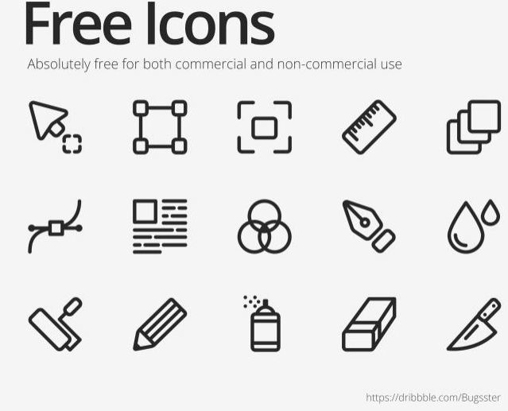
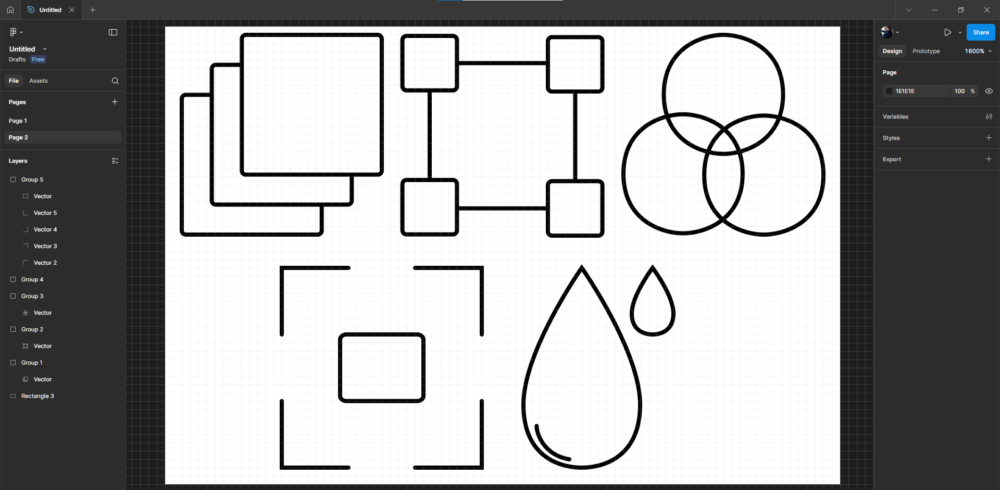

# Практична робота №4 – Криві Безьє, векторні об'єкти  у Figma. Створення векторних значків (іконок).

## Хід роботи:
Мета цієї практичної роботи - за"Керівництвом користувача фігма" опрацювати матеріал розділів №9 - Перо,  №10 - Векторні мережі. Опанувати у Figma інструмент Pen Tool для створення кривих Безьє (в допомогу The Bezier Game https://bezier.method.ac/?authuser=0). Створити  п'ять іконок  за вибором (https://drive.google.com/file/d/1Vanbvj57RCkxzjc9l3226L7qfGmYZt9L/view?usp=sharing)  у border (обводочному) стилі. Кожну іконку створюємо в окремому  фреймі (24*24).

### Приклад завдання:

### Результат:

Повідомляю, що перед виконанням завдання я ознайомився з розділами 9 та 10 за "Керівництвом користувача фігма" та переглянув декілька рівнів із запропонованого викладачем сайту з кривими Безьє.

Посилання на виконане завдання - https://www.figma.com/design/TA7U8OiLSpn8gr9vg1Q5BE/Untitled?node-id=9-2&p=f&t=FUSLf4Pah7MH6hK7-0.

## Висновки:
>*Що було зроблено на практиці?*
>
>На практиці було створено 5 іконок, використовувався обводочний стиль.   

>*Чому я навчився?*
>
>Я навчився працювати з інструментом Перо та використовував цей інструмент для створення кривих Безьє з векторними мережами. 
