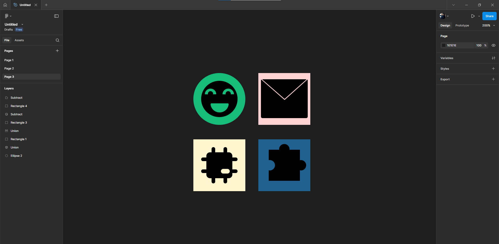

# Практична робота №6 – Булеві групи і флетен у Figma

## Хід роботи:
Мета цієї практичної роботи - За"Керівництвом користувача фігма" опрацювати матеріал розділу №11 - Булеві групи і флетен (стор 62). Виконати практикум. Опанувати у Figma інструменти по додаванню і відніманню фігур (булеві групи).
Створити два (будь яких) значка у заливковому стилі (solid), використовуючи при цьому булеві групи.

### Приклади до завдання:

Ідеї для створення позичив з - https://www.figma.com/community/file/1172462469357415529/free-solid-icons-flex-vector-icon-set-svg.

### Результат роботи:

Повідомляю, що перед виконанням завдання я ознайомився з розділом 11 за "Керівництвом користувача фігма".

Посилання на виконане завдання - https://www.figma.com/design/TA7U8OiLSpn8gr9vg1Q5BE/Untitled?node-id=25-2&p=f&t=lJxvBbBh6IC1VymU-0.

## Висновки:
>*Що було зроблено на практиці?*  
>На практиці було створено 4 іконки, використовувався заливковий стиль.   

>*Чому я навчився?*  
>Я навчився працювати з інструментами по додаванню і відніманню фігур та використовував ці інструменти для створення значків (іконок). 