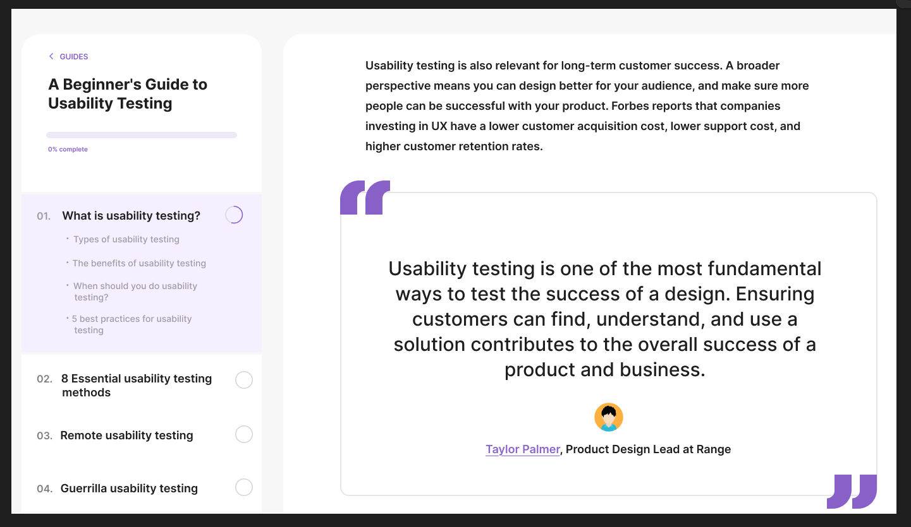

# ПЗ-7 Типографіка в дизайні інтерфейсів та ПЗ-8 Типографіка  в дизайні користувальницького інтерфейсу. Частина 2

## Хід роботи:
Мета цієї практичної роботи - Опрацювати теоретичний матеріал (https://docs.google.com/document/d/1IAKGCHHd1mB2Ecz_xdSHvbygmMeIOiWp-nQBAQz_JlY/edit?usp=sharing) 

Додатковий матеріал 
https://ukrfonts.com/index.php?v=19&authuser=0
https://fonts.google.com/?authuser=0
https://www.figma.com/file/NXddbPnsJQ5ADUwoGdMsKh/Типографія?type=design&node-id=0%3A1&t=c7PQdggvjT85QF4j-1&authuser=0
https://www.youtube.com/watch?v=EehK2JRDtnQ&authuser=0
https://drive.google.com/file/d/18S1lYmeAh4xGIovg44CwhSOCngpueTV0/view?usp=classroom_web&authuser=0
https://drive.google.com/file/d/1rb-lgdkOOBgXMam6sj8aNRELAr8vgixE/view?usp=drive_link

Переглянути відео https://www.youtube.com/watch?v=VouVsut_-Ak&authuser=0.
Виконати завдання із файлу figma 3 (https://drive.google.com/file/d/12fv8sQYKbUh5xucpRgf9Xvayo7uZKOEh/view?usp=sharing).

### Виконане завдання:

Посилання на виконане завдання - https://www.figma.com/design/jTpyq6FMOpmTqklm1Q9FrG/Untitled?node-id=32-2&p=f&t=VqYuZiMbnfvM6IK1-0.

## Висновки:
>*Що було зроблено на практиці?*
>На практиці було виконано завдання, для цього довелось ознайомитись із типографікою та основними концептами у типографії у середовищі Figma.   

>*Чому я навчився?*
>Я навчився точно повторювати дизайн, працюючи зі шрифтами, гарнітурами та навчився використовувати основні концепти типографії на власному макеті. 
