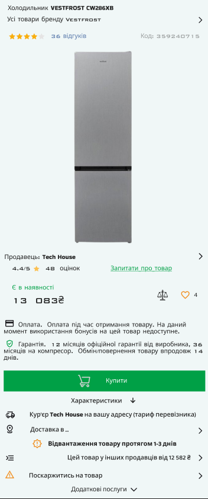

# Практична робота №9 - Функція Auto layout у Figma. Створення картки товару (послуги).

## Хід роботи:
Мета цієї практичної роботи - Створити малу картку товару,  використовуючи Auto layout у Figma. При оформленні використати відповідне зображення , текст, значки !!!!!

Плагіни  Figma в допомогу :
Unsplash   - імпорт зображень різних категорій.
Feather Icons,  iconsax 6000+  – імпорт значків (іконок)
Remove BG - Автоматично видаляє фон із зображень. Для цього плагіна Вам знадобиться обліковий запис remove.bg
Сайти в допомогу із безкоштовними зображенями:

https://www.freepik.com/home
https://pixabay.com/
https://dribbble.com/

Сайти в допомогу із безкоштовними значками:
https://fonts.google.com/icons
https://www.flaticon.com/
https://iconarchive.com/
https://www.iconfinder.com/free_icons
https://iconmonstr.com/

### Результат роботи:

Посилання на виконане завдання - https://www.figma.com/design/jTpyq6FMOpmTqklm1Q9FrG/Untitled?node-id=63-2&p=f&t=NqL5Ygdr2KlvqTSf-0.

## Висновки:
>*Що було зроблено на практиці?*  
>На практиці було створено картку товару із використанням Auto layout та його функцій (автоматичне вирівнювання, збереження відступів і т.д.).   

>*Чому я навчився?*  

>Я навчився працювати з Auto layout, тепер можу використовувати його як допомогу під час організування, розташування і розподілення елементів дизайну, роблячи мої проекти адаптивними. 
